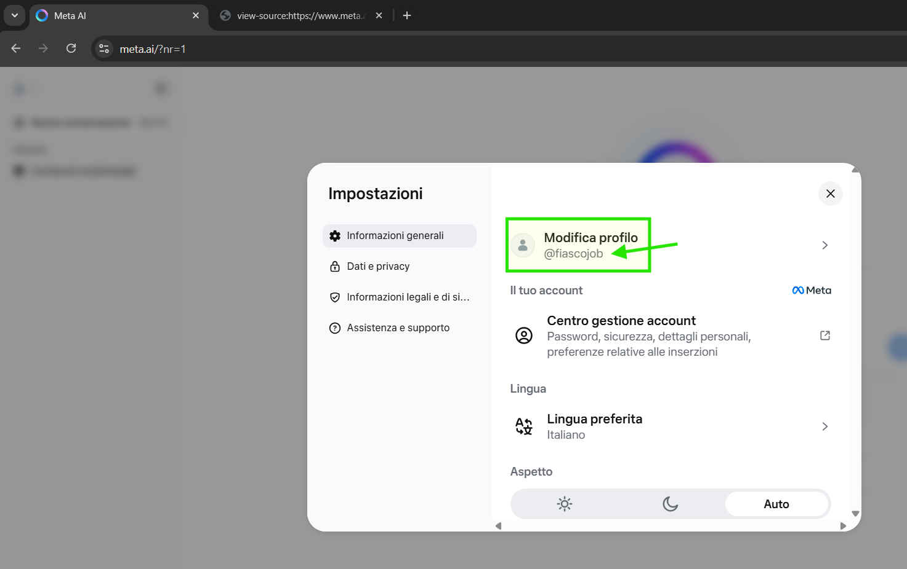

# Meta AI Wrapper

Questo progetto fornisce un wrapper FastAPI per interagire con Meta AI utilizzando Selenium, consentendo l'integrazione con sistemi compatibili con l'API OpenAI. Include anche uno script per l'acquisizione dei cookie di sessione.

## Autore

- Ugo Fiasconaro
- Sito web: [https://www.fiasconaro.info/](https://www.fiasconaro.info/)
- LinkedIn: [https://www.linkedin.com/in/ugofiasconaro](https://www.linkedin.com/in/ugofiasconaro)
- E-Mail e Phone Number:  Check Top Bar of my Website / Use WhatsApp for better support
- GitHub: [https://github.com/ugofiasconaro](https://github.com/ugofiasconaro)
- License: MIT License

## Struttura del Progetto

- `send_message.py`: Il server FastAPI che espone un endpoint `/chat/completions` compatibile con l'API OpenAI. Utilizza Selenium per interagire con Meta AI.
- `grab_cookies.py`: Uno script per acquisire i cookie di sessione da Meta AI tramite Selenium, necessari per mantenere la sessione.
- `requirements.txt`: Elenco delle dipendenze Python.
- `Dockerfile`: Definisce l'ambiente Docker per l'applicazione, inclusa la gestione della persistenza dei dati di sessione e l'esecuzione condizionale degli script.
- `entrypoint.sh`: Script di ingresso per il container Docker che decide quale script Python eseguire (`send_message.py` o `grab_cookies.py`) in base a una variabile d'ambiente.
- `session_data.json`: File JSON utilizzato per salvare e caricare i dati della sessione (cookie, user agent, fb_dtsg).

## Configurazione e Utilizzo con Docker

Il progetto è containerizzato utilizzando Docker per facilitare la distribuzione e la gestione delle dipendenze.

### Prerequisiti

- Docker installato e funzionante.

### 1. Costruire l'Immagine Docker

Naviga nella directory principale del progetto dove si trova il `Dockerfile` ed esegui il seguente comando:

```bash
docker build -t meta-ai-wrap .
```

### 2. Acquisire i Cookie di Sessione (Prima Esecuzione o Rinnovo)

Per interagire con Meta AI, è necessario acquisire i cookie di sessione. Questo viene fatto eseguendo lo script `grab_cookies.py` all'interno del container Docker. Questo processo richiede un'interazione manuale per il login nel browser.

Per eseguire `grab_cookies.py` e salvare i cookie in un volume persistente, usa il seguente comando:

```bash
docker run -it -v /percorso/sul/tuo/host:/app/data -e APP_MODE=grab_cookies -e WEBDRIVER_URL="http://127.0.0.1:4444" meta-ai-wrap
```

- Sostituisci `/percorso/sul/tuo/host` con un percorso assoluto sul tuo sistema host dove vuoi che il file `session_data.json` venga salvato (es. `/c/Users/TuoUtente/meta_ai_data` su Windows con Git Bash/WSL, o `/home/tuoutente/meta_ai_data` su Linux/macOS).
- `-it`: Abilita la modalità interattiva e alloca una pseudo-TTY, necessaria per l'interazione manuale con il browser e per il prompt `Premi INVIO`.
- `-e APP_MODE=grab_cookies`: Indica all'`entrypoint.sh` di eseguire `grab_cookies.py`.
- `-e WEBDRIVER_URL="http://127.0.0.1:4444"`: Specifica l'URL del Selenium WebDriver. Assicurati che un'istanza di Selenium Grid o Chromedriver sia in esecuzione e accessibile a questo indirizzo.

Dopo aver eseguito il comando, si aprirà una finestra del browser. Effettua il login su Meta AI e, una volta completato, torna al terminale e premi INVIO per consentire allo script di acquisire i cookie e salvarli in `session_data.json` nel volume mappato.

### 3. Avviare il Server FastAPI

Una volta acquisiti i cookie, puoi avviare il server FastAPI. Questo server utilizzerà i cookie salvati per interagire con Meta AI.

```bash
docker run -p 8000:8000 -v /percorso/sul/tuo/host:/app/data -e WEBDRIVER_URL="http://127.0.0.1:4444" -e SELENIUM_HEADLESS="true" meta-ai-wrap
```

- `-p 8000:8000`: Mappa la porta 8000 del container alla porta 8000 del tuo host.
- `-v /percorso/sul/tuo/host:/app/data`: Mappa lo stesso volume utilizzato per `grab_cookies.py` per accedere ai dati di sessione persistenti.
- `-e WEBDRIVER_URL="http://127.0.0.1:4444"`: Specifica l'URL del Selenium WebDriver.
- `-e SELENIUM_HEADLESS="true"`: Esegue Selenium in modalità headless (senza interfaccia grafica del browser). Imposta a `"false"` se desideri vedere il browser.

Il server sarà accessibile all'indirizzo `http://localhost:8000`.

### Variabili d'Ambiente

Il progetto utilizza le seguenti variabili d'ambiente configurabili tramite Docker:

- `APP_MODE`: Controlla quale script viene eseguito dall'`entrypoint.sh`. Può essere `grab_cookies` o qualsiasi altro valore (per avviare il server Uvicorn).
- `WEBDRIVER_URL`: L'URL del Selenium WebDriver (es. `http://127.0.0.1:4444`).
- `SELENIUM_HEADLESS`: Se impostato a `"true"`, Selenium viene eseguito in modalità headless. Altrimenti, il browser sarà visibile.
- `DEBUG_ENABLED`: Se impostato a `"true"`, abilita la modalità debug con logging esteso.
- `METAAI_USERNAME`: Il nome utente di Meta AI, necessario per il check dell'utente loggato durante l'esecuzione.
- `SESSION_FILE_PATH`: Il percorso all'interno del container dove `session_data.json` viene letto e scritto (predefinito: `/app/data/session_data.json`).

#### Come ottenere `METAAI_USERNAME`

Per ottenere il valore di `METAAI_USERNAME`, Dopo il login sul tuo Meta AI vai su impostazioni di meta ai, e inserisci il tuo username senza il simbolo della "@" puoi fare riferimento alla seguente immagine:





## Funzionamento Generale

Il sistema è progettato per separare l'acquisizione iniziale dei cookie (che richiede interazione manuale) dall'esecuzione continua del server FastAPI. I cookie vengono salvati in un volume Docker, garantendo che persistano tra le diverse esecuzioni del container. Questo permette al server FastAPI di riavviarsi e continuare a utilizzare la stessa sessione di Meta AI senza richiedere un nuovo login manuale ogni volta.